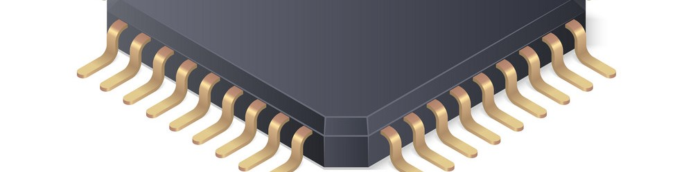

# Baremetal Development

I’ve gained substantial experience with a number of baremetal architectures. I have some exposure to FPGA programming using both HDL and Verilog.
I’ve programmed 16-bit Microchip PIC’s with a combination of C and Microchip Assembly.
I’ve also written code for Atmel chips using both C++ and Atmel Assembly.
I’ve worked with more sophisticated architectures with the Raspberry Pi and similar SoC boards, but only on a full OS stack.
