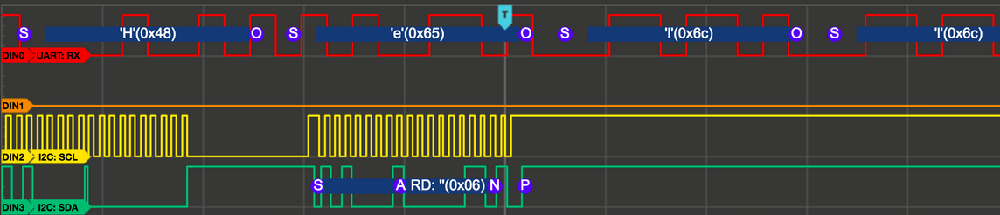

# Hardware Debugging Tools

I’ve used an Oscilloscope on multiple occasions for debugging and tuning simple analog circuits, like signal filters, and harmonic oscillators.
I’ve used a multimeter, usually for testing continuity, checking voltages, and detecting bad components.
I picked up a logic-level analyzer several months ago, and have used it to capture low-level communication from hardware both  to analyze and decode protocols, and verify proper behavior.
I’ve also tested hardware in a hardware simulation environment, using the same external device to supply all inputs to the hardware, and test all outputs for expected behavior.
