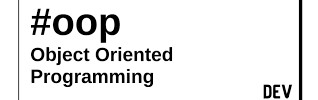

# Object Oriented Design

From the beginning of my education in Software Engineering, good application of Object Oriented design has been emphasized. I quickly gained a grasp of OO principles, have applied them in nearly every project I've worked on since, and would consider myself a near-expert in all things Object Oriented, especially as supported in C++.
